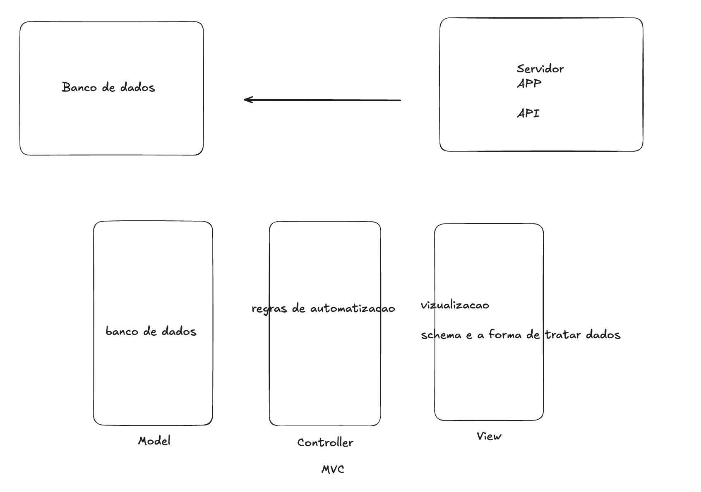

# Sistema de Coleta e Armazenamento de Dados de Pokémon

Este projeto foi desenvolvido para integrar com a API pública do Pokémon, coletar dados sobre os Pokémon e armazená-los em um banco de dados SQLite. O sistema utiliza várias ferramentas, como SQLAlchemy para interação com o banco de dados, Pydantic para validação de dados e requests para fazer chamadas HTTP à API do Pokémon.

## Funcionalidades

- Coleta dados de Pokémon da API pública do Pokémon.
- Armazena os dados de Pokémon (nome e tipo) em um banco de dados SQLite.
- Executa continuamente e adiciona dados de Pokémon a cada 10 segundos.
- Utiliza o SQLAlchemy para gerenciar o banco de dados.
- Utiliza o Pydantic para validação e serialização de dados.
- Gerenciado com Poetry e pyenv para gerenciamento de dependências e versões do Python.

## Configuração

### Pré-requisitos

Antes de começar, você precisa ter as seguintes ferramentas instaladas:

- **Python** (local 3.12.11)
- **Poetry** para gerenciamento de dependências(3.12.11)

## Explicação do Código
1. Configuração do Banco de Dados
- O SQLAlchemy é utilizado para configurar a conexão com o banco de dados SQLite onde os dados dos Pokémon são armazenados.
- A tabela pokemons é criada no banco de dados, contendo as colunas id, name, type e created_at.

2. Modelos e Schemas
-O modelo Pokemon define a estrutura dos dados dos Pokémon no banco de dados.
- O PokemonSchema é um esquema Pydantic utilizado para validação dos dados ao receber dados da API.

3.Funções Principais
- fetch_pokemon_data(pokemon_id: int): Coleta os dados do Pokémon da API utilizando o ID do Pokémon fornecido. Se bem-sucedido, retorna um objeto PokemonSchema com o nome e tipo do Pokémon.
- add_pokemon_to_db(pokemon_schema: PokemonSchema): Adiciona um Pokémon ao banco de dados com base no esquema fornecido.

## Tecnologias Utilizadas
- SQLAlchemy: ORM utilizado para interagir com o banco de dados SQLite.
- Pydantic: Usado para validação e serialização de dados.
- requests: Realiza as requisições HTTP à API do Pokémon.
- SQLite: Banco de dados utilizado para armazenar os dados dos Pokémon.
- Poetry e pyenv: Usados para gerenciamento de dependências e versões do Python.